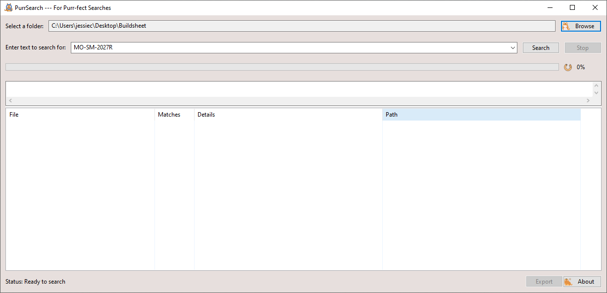
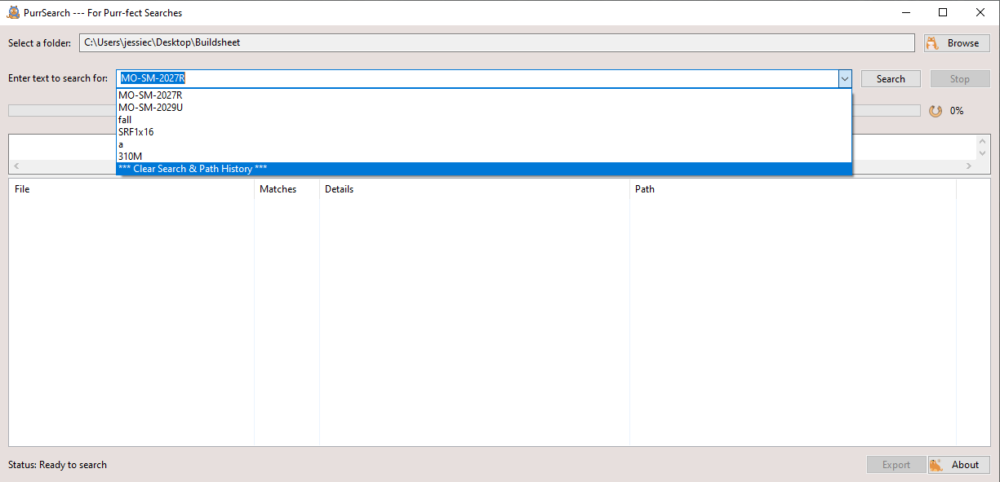
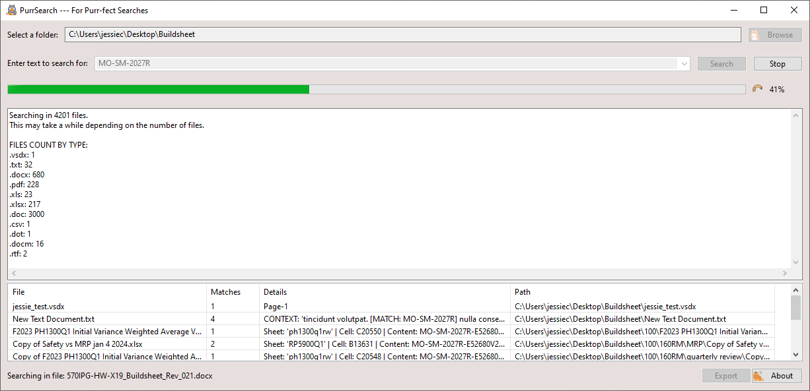
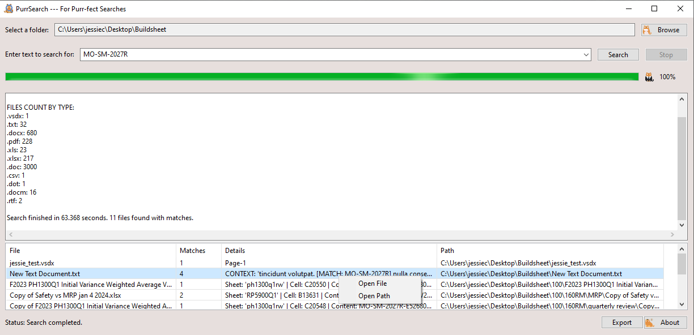
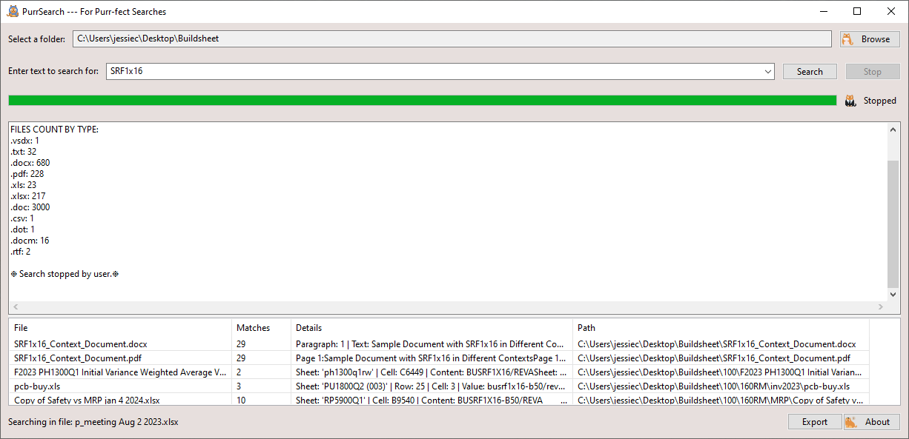
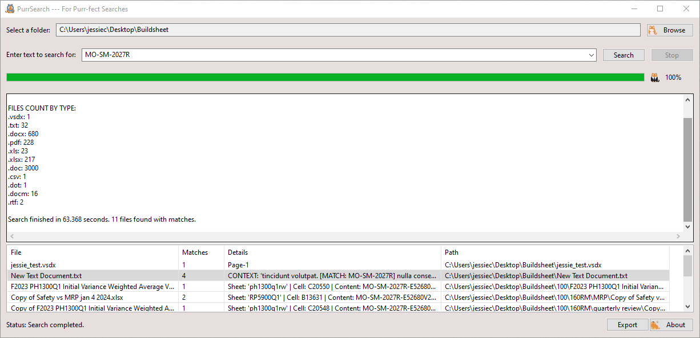
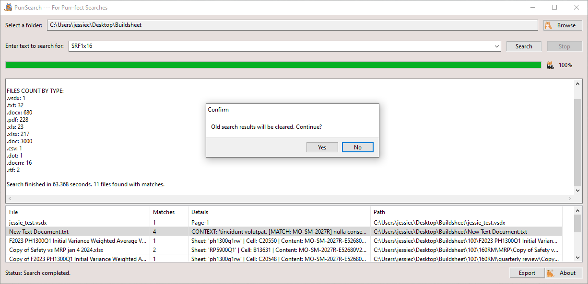
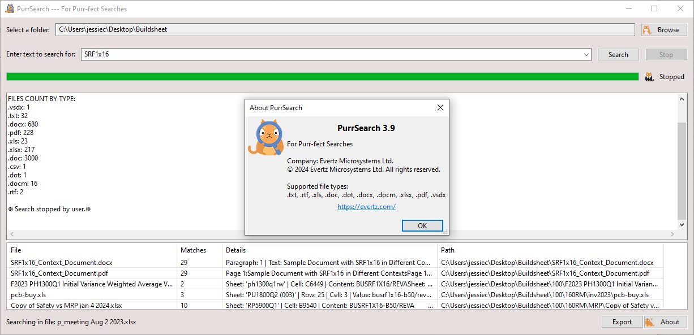

# PurrSearch - For Purr-fect Searches
**PurrSearch** is a powerful application designed to search for specific text within files in a selected folder, including its subfolders. It supports multiple file types such as `.txt`, `.rtf`, `.xls`, `.doc`, `.dot`, `.docx`, `.docm`, `.xlsx`, `.pdf`, and `.vsdx`.

---

## **Features**
- Search text in a chosen folder and its subfolders.
- Support for various file formats.
- Browse search history or clear it.
- Export search results to an Excel file.
- Options to open files or file paths directly from the search results.

---

## **Installation & Usage**

### **Installation**
1. **Download**  
   Download the latest version of `PurrSearch.exe` from the following link:  
   [Download PurrSearch v3.9.9](https://github.com/Jessiepxd/PurrSearchApp/tree/6329faad87d41fc388d2fee8437b55c4c1d4c459/dist)

2. **Start the Application**  
   Double-click the downloaded file to start the app.

---

### **Instructions**

1. **Search Path and Term History**  
   - On startup, the app will display the latest search path and term.  
   - For first-time users, these fields will be blank.
   

2. **Choosing a Folder**  
   - Click the **Browse** button to select a folder for the search.  
   - Subfolders within the selected folder will be included automatically.

3. **Search Term**  
   - Enter the text you want to search for.  
   - Use the dropdown menu to access past search terms or clear the search history.
     

4. **Start Search**  
   - Click the **Search** button to initiate the search.  
   - Panels will display:
     - Total number of files being searched.
     - Breakdown of file types being searched.
     - Search results.
     

5. **View Results**  
   - Files containing the search term will be displayed in the results window.  
   - **Right-click** a file in the results to:
     - Open the file (**Open File**).
     - Open the file's location in your file explorer (**Open Path**).
     

6. **Interrupt Search**  
   - Click the **Stop** button to halt the search at any time.
     

7. **Export Results**  
   - After the search is complete, click the **Export** button to save the results to an Excel file.
     

8. **Start New Search**  
   - Initiating a new search will automatically clear the results from the previous search.
     

9. **Help & Version Info**  
   - Click **About** or press **F1** to view the app's version details.
     

10. **Keyboard Navigation**  
    - Use the **Tab** key to navigate through the app's interface.

---

### **Supported File Formats**
- **Text Files**: `.txt`, `.rtf`, `.csv`
- **Microsoft Office Files**: `.xls`, `.doc`, `.dot`, `.docx`, `.docm`, `.xlsx`
- **PDF Files**: `.pdf`
- **Visio Files**: `.vsdx`
- **Log Files**: 
  - Standard log files: `.log`
  - System logs: `messages`, `syslog`, `dmesg`
  - Numbered log files: `.1`, `.2`, etc.
  - Time-stamped logs like `dpkg.log.20191201.1575181021`
- **Compressed Files**: `.gz`

---

## **Note**
- The application will include subfolders in the search automatically.
- Exported search results are saved in an Excel-compatible format.

---

Make searching files seamless and efficient with **PurrSearch**!
